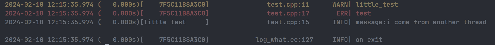

# LINUX环境 LOG_WHAT 异步日志库

***简单使用：***

./install.sh 编译成为动态链接库并直接move到 /lib/文件夹下 使用时只需要include log_what.hpp头文件并在编译命令中加入 -llog 链接动态链接库，你也可以自行修改install文件

***简单介绍***

* VerbosityFATAL
* VerbosityERROR
* VerbosityWARNING
* VerbosityINFO
* VerbosityMESSAG

```
#include "log_what.hpp"
#include <thread>

using namespace std;

int main(int argc, char *argv[]) {
  what::Log::Init(argc, argv);
  what::Log::flush_interval_ms = 100;
  what::Log::Add_file("log/log.txt", what::Log::FileMode::Truncate,
                      what::Log::Verbosity::VerbosityMESSAGE);
  LOG(WARNING, "little_test");
  auto item = std::thread([]() {
    what::Log::Set_thread_name("little test");
    auto it = "i come from another thread";
    LOG(INFO, "message:%s\n", it);
  });
  LOG(ERROR, "test");
  item.join();
}
```


